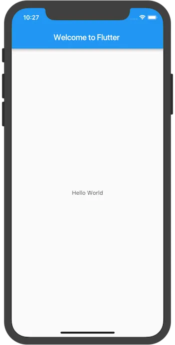
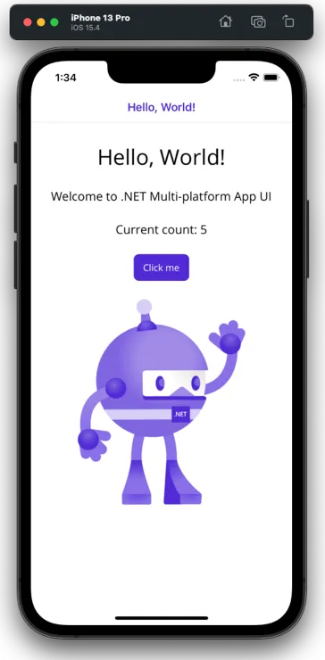
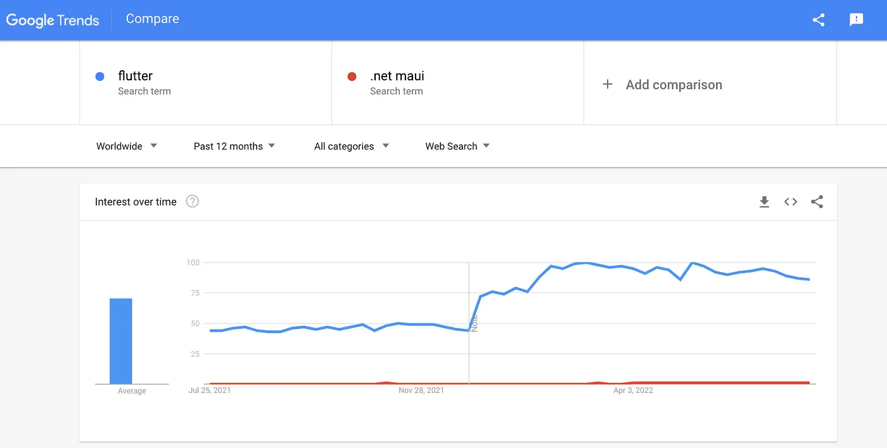

Here it is — my post for [.NET MAUI UI July](https://goforgoldman.com/posts/maui-ui-july/).

### MAUI
MAUI (Multi-platform App UI) is a framework from Microsoft.  

Docs: https://docs.microsoft.com/en-us/dotnet/maui/get-started/first-app

**✅ Pros:**

- .NET — MAUI is built on to the .NET ecosystem. This means .NET developers will feel at home and be able to use their favourite Nuget packages

**❌ Cons:**  
- Immature — Released in May 2022, MAUI hasn’t had a chance to be put to the test

 
### Flutter

Built, maintained and used by Google, Flutter boasts the ability to deploy to mobile, web and desktop from a single codebase.  
Docs: https://docs.flutter.dev/get-started/codelab

✅ Pros:
- Maturity — Flutter 1.0 was launched in December 2018 and has had time to build a community
- More supported platforms — Runs on Linux 🐧

❌ Cons:
- Dart — To build flutter apps, developers will need to learn a new language.

---

### 🤔 The key differences
These are the important considerations when deciding between MAUI and Flutter.
* Flutter apps can be deployed to the web. This isn't possible with MAUI but you can create a solution that shares Blazor UI code between a Blazor app and MAUI app. See https://docs.microsoft.com/en-us/aspnet/core/blazor/hybrid/tutorials/maui
* Flutter doesn’t have a markup language — All UI is defined in code (Dart) MAUI lets developers define UI in XAML more info: https://docs.flutter.dev/resources/faq#where-is-flutters-markup-language-why-doesnt-flutter-have-a-markup-syntax
* Native UI with MAUI. Using Flutter without any extra configuration, your UI will look great on Android, but out of place on all other platforms. MAUI apps use native components and look at home on all supported platforms. It’s possible to make Flutter apps look native on iOS using the Cupertino widgets, but this is extra work developers dont need to do with MAUI.

  
**👎 Flutter app looks out of place on iOS**

  
**👍 iOS MAUI App uses native components**

---

### 📸 Which is more popular?

  
**Google Trends comparison of MAUI and Flutter**

Flutter seems to be far more popular than MAUI. This is expected as MAUI has only been generally available since May.

> Note: I used ‘.net maui’ instead of ‘maui’ to avoid confusion between Maui, the Island in Hawaii and Maui, the Disney movie character. This could have impacted the results. 

---

### 🧑‍💻 Development experience
#### MAUI
https://docs.microsoft.com/en-us/dotnet/maui/get-started/first-app
1. Installation — At the time of writing this, installing MAUI is only documented for Windows. Visual Studio 2022 makes installation very easy.
2. Hello World — You can create new apps using `dotnet new maui` or through VS 2022
3. Debugging — You can debug or run your MAUI app using `dotnet run`, but the best dev experience will be using VS 2022
4. IDE — VS 2022 is recommend, but I found JetBrains Rider supports MAUI pretty well

#### Flutter
https://docs.flutter.dev/get-started/install
1. Installation — The steps to install Flutter were easy. The process is well documented for Windows, macOS, Linux and even ChromeOS!
2. Hello world — Creating a new flutter app is as easy as running `flutter create new_app` in a terminal
3. Debugging — you can run your Flutter app on any target using the `flutter run` command
4. IDE — The Flutter team recommends you use Android Studio or VS Code to build your app

### 📖 Summary
MAUI and Flutter are both strong competitors in the cross-platform app space, but the best option heavily depends on the developer's experience and the application they are building. For example, if you are already a .NET developer learning MAUI will be easier than Flutter. From personal experience, I found that writing UI code in Dart is easier than in XAML but I would still choose MAUI because it is a part of the .NET ecosystem.
Let me know what you think of MAUI and Flutter. What do you prefer?
