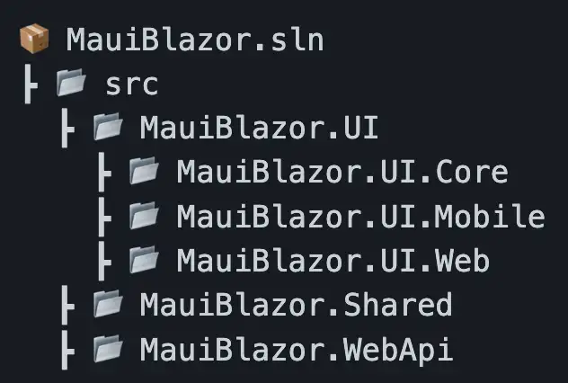
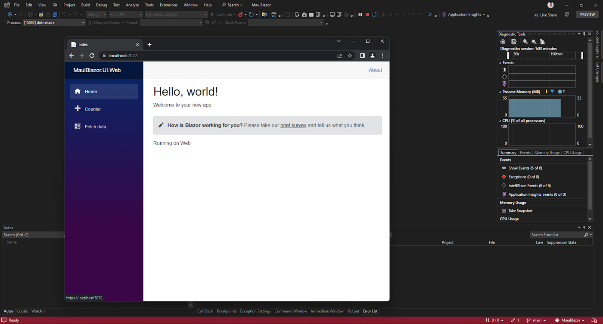
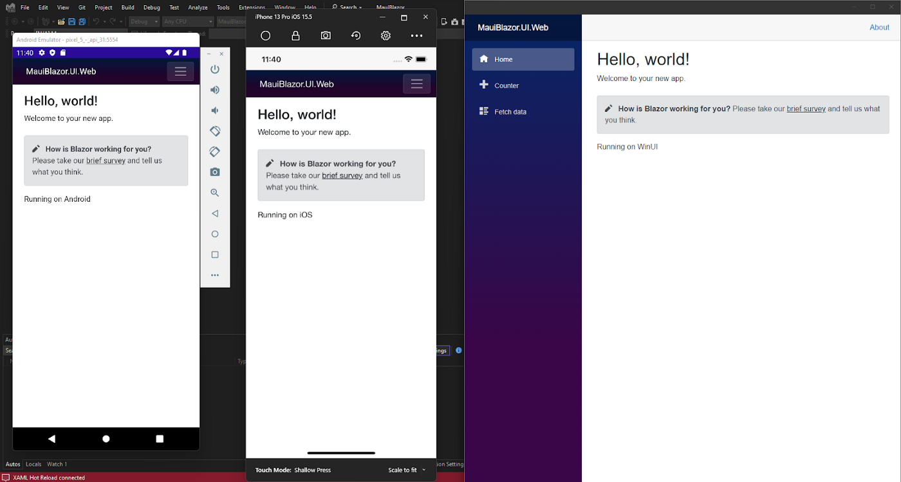

Another post for Matt Goldman’s MAUI UI July!  
https://goforgoldman.com/2022/05/19/maui-ui-july.html

---

## 🙋 What is MAUI Blazor

> MAUI Blazor lets you host Blazor components in .NET MAUI apps to build cross-platform native apps using web UI. The
> components run natively in the .NET process and render web UI to an embedded web view control using a local interop
> channel. This hybrid approach gives you the best of native and the web.

From Introduction to .NET MAUI
Blazor: https://docs.microsoft.com/en-us/shows/xamarinshow/introduction-to-net-maui-blazor--the-xamarin-show

When I first read about MAUI Blazor I was excited at the idea of building my UI just once and being able to run and
deploy it everywhere. When I tried it out for the first time I was disappointed to find the official MAUI Blazor
template only had a MAUI app — No Blazor.
I decided I’d build a template with the whole solution in a nice structure so I can start developing fully
cross-platform apps quickly.

Here it is!  
https://github.com/bradystroud/MauiBlazorTemplate

---

## 🏛 Template Overview



### MauiBlazor.UI

Folder with all the UI projects

### MauiBlazor.UI.Core

This is where all the UI code will be written. This is also where I keep shared code like the ApiClient

### MauiBlazor.UI.Mobile

MAUI application with a BlazorWebView component that uses the razor pages in UI.Core

### MauiBlazor.UI.Web

Blazor WASM app that uses the razor pages in UI.Core

### MauiBlazor.Shared

A shared project between the UI and WebApi for classes that are used on both sides of the application.

### MauiBlazor.WebApi

ASP.NET Core Web API as a backend for the UI.

## 🧑‍💻 Developer Experience

Running these applications in different environments is easy.

Recommend environment: Windows 10/11, [VS 2022](https://visualstudio.microsoft.com/vs/preview/) Preview (using preview
for MAUI support) with MAUI and ASP.NET workloads installed.

To run the Blazor app, open VS 2022 Preview and select MauiBlazor.UI.Web as the startup project.  
Hit F5 and wait for a browser to open.


**Template running on the Web**

To run the MAUI app, open VS 2022 Preview and select MauiBlazor.UI.Mobile as the startup project.   
Pick a target framework (e.g. Andriod emulator or Windows Machine) and hit F5.


**Template running MAUI project on Andriod, iOS and Windows 🤯**

> **Tip:** You can test out your app on iOS from windows by pairing a Mac in VS.
> See https://docs.microsoft.com/en-us/xamarin/ios/get-started/installation/windows/connecting-to-mac/

To run the API as well as one of the UI projects, use the .NET CLI. `cd` into the `MauiBlazor.WebApi` project
then `dotnet run`

## 🤔 What if I want to run some different code on each platform?

I saw how this was possible in [this video](https://www.youtube.com/watch?v=sGYIDKx6cY0).

You can do this by creating an interface in UI.Core, and write unique implementations of it in UI.Web and UI.Mobile.

> **Tip:** I linked the filename to the file in GitHub

### [UI.Core/Interfaces/IPlatformService.cs](https://github.com/bradystroud/MauiBlazorTemplate/blob/main/src/MauiBlazor.UI/MauiBlazor.UI.Core/Interfaces/IPlatformService.cs)

```csharp
namespace MauiBlazor.UI.Core.Interfaces;

public interface IPlatformService
{
    string GetPlatformName();
}
```

### [UI.Web/Services/PlatformService.cs](https://github.com/bradystroud/MauiBlazorTemplate/blob/main/src/MauiBlazor.UI/MauiBlazor.UI.Web/Services/PlatformService.cs)

```csharp
using MauiBlazor.UI.Core.Interfaces;

namespace MauiBlazor.UI.Web.Services;

public class PlatformService : IPlatformService
{
    public string GetPlatformName() => "Web";
}
```

### [UI.Mobile/Services/PlatformService.cs](https://github.com/bradystroud/MauiBlazorTemplate/blob/main/src/MauiBlazor.UI/MauiBlazor.UI.Mobile/Services/PlatformService.cs)

```csharp
using MauiBlazor.UI.Core.Interfaces;

namespace MauiBlazor.UI.Mobile.Services;

public class PlatformService : IPlatformService
{
    // Returns the current platform name e.g. WinUI or Andriod
    public string GetPlatformName() =>
        DeviceInfo.Current.Platform.ToString();
}
```

Once I have both services, I can make them available in UI.Core via dependency injection.

### [UI.Web/Program.cs](https://github.com/bradystroud/MauiBlazorTemplate/blob/main/src/MauiBlazor.UI/MauiBlazor.UI.Web/Program.cs)

```csharp
builder.Services.AddScoped<IPlatformService, PlatformService>();
```

### [UI.Mobile/MauiProgram.cs](https://github.com/bradystroud/MauiBlazorTemplate/blob/main/src/MauiBlazor.UI/MauiBlazor.UI.Mobile/MauiProgram.cs)

```csharp
builder.Services.AddScoped<IPlatformService, PlatformService>();
```

Now I can inject the method into a component and call `GetPlatform()`

### [UI.Core/Pages/Index.razor](https://github.com/bradystroud/MauiBlazorTemplate/blob/main/src/MauiBlazor.UI/MauiBlazor.UI.Core/Pages/Index.razor)

```html
@page "/"
@inject IPlatformService PlatformService

<PageTitle>Index</PageTitle>
<h1>Hello, world!</h1>

Welcome to your new app.

<SurveyPrompt Title="How is Blazor working for you?"/>

Running on @Platform

@code {
private string Platform => PlatformService.GetPlatformName();
}
```

### 🚀 Deploying the application

In the future, I’ll set up all the CI/CD stuff needed to build and deploy the application in all supported
environments.   
See GitHub issue: https://github.com/bradystroud/MauiBlazorTemplate/issues/3  
Let me know what you would like to see in this template. If you have any ideas/feedback please make a PR or issue and
I’ll take a look.

Looking forward to seeing your feedback!
